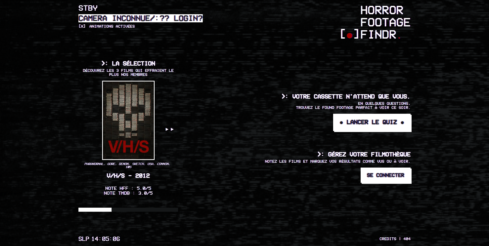

# Horror Footage Finder

Je pense que nous avons tous été abonnés à une plateforme de streaming, et face à la quantité de films proposés, souvent nous ne savons quoi regarder. Etant dans notre équipe tous cinéphile, on adore conseiller des films aux gens, mais souvent, c’est notre mémoire qui fait défaut : on se souvient plus des titres, on oublie certains films qu’on a déjà vus… ce n’est pas idéal. Du coup, on s’est dit : et si on créait une application qui fait ça à notre place : et c’est comme ça qu’on a voulu construire un petit outil qui conseille aux gens des films d’horreur, parce qu’il s’avère qu’on aime bien se faire peur. Je me permets d’apporter une petite précision sur l’application, aujourd’hui, on ne traite pas de tous les films d’horreur mais d’un sous-genre bien précis, qui s’appelle : le found footage. Si vous ne connaissez pas le terme, ça désigne les films d’horreur filmés à la caméra numérique style vidéo de vacances ou faux-documentaire qui tourne mal. Si je vous dis Rec, Paranormal Activity, ou Projet Blair Witch, je pense que vous avez l’idée de ce que c’est. L’application est exhaustive sur ce sous-genre, mais ne concerne, pour le moment, que ce sous-genre à cause des contraintes de temps imposées pour ce projet. Notre application a donc pour vocation de proposer un outil pour mettre en lien les gouts d’un utilisateur en matière de cinématographique avec des films d’horreurs. Elle propose également une expérience visuel atypique. Et enfin notre projet permet à nos utilisateurs de gérer une liste de films à voir propre à chaqu’un.

:fire: [Lien vers notre site](https://horror-footage-finder.netlify.app/splash) :fire:

